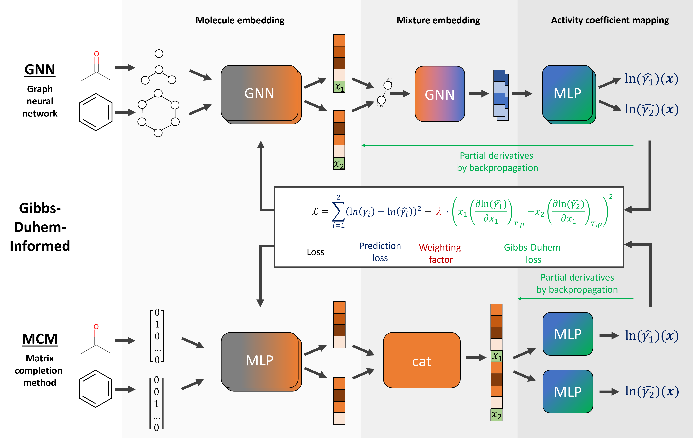
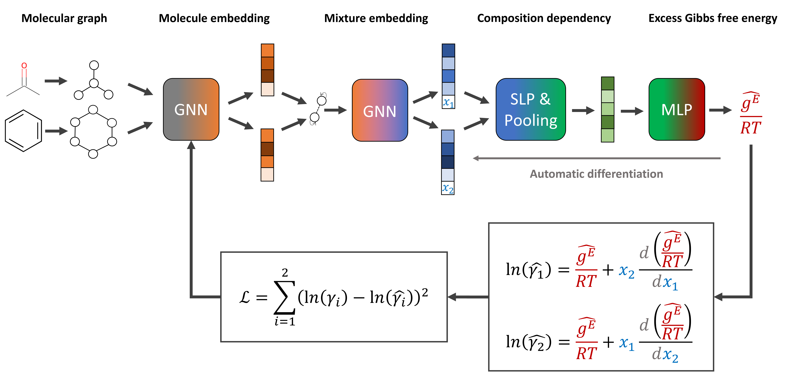

# Graph Neural Networks with Thermodynamic Insights for Binary Activity Coefficient Prediction

This is the source code for the the two papers:
* **[Gibbs-Duhem-Informed Neural Networks for Binary Activity Coefficient Prediction](https://doi.org/10.1039/D3DD00103B)** (Digital Discovery). 
* **[Thermodynamics-Consistent Graph Neural Networks]()** (preprint, awaiting link from arXiv). 

## Overall framework structures
* Gibbs-Duhem-informed models (GNN and MCM)


* Excess Gibbs free energy GNN


## Data & Usage

This repository contains following folders:

* **data**: acitvity coefficient dataset [1] for training the GNN and MCM [2,3]
* **doc**: documentation
* **models**: GNN and MCM model structure
* **util**: util functions

### Data

The data set of binary activity coefficient was created by Qin et al. [1]. We added created further data for validation with COSMO-RS [4,5].

### Usage

For **running** the GNN or MCM model, please install the required environment (see below) and then execute
`train.py` for training
or 
`infer.py` for inference/evaluation of the model against experimental data.

The model architecture (SolvGNN, MCM, GE-GNN, etc.) can be selected via `--model_type`, cf. the model folder.

References:
* [1]: Qin, S., Jiang, S., Li, J., Balaprakash, P., Van Lehn, R. C., & Zavala, V. M. (2023). Capturing molecular interactions in graph neural networks: a case study in multi-component phase equilibrium. Digital Discovery, 2(1), 138-151.
* [2]: Chen, G., Song, Z., Qi, Z., & Sundmacher, K. (2021). Neural recommender system for the activity coefficient prediction and UNIFAC model extension of ionic liquid‐solute systems. AIChE Journal, 67(4), e17171.
* [3]: Rittig, J. G., Ben Hicham, K., Schweidtmann, A. M., Dahmen, M., & Mitsos, A. (2023). Graph neural networks for temperature-dependent activity coefficient prediction of solutes in ionic liquids. Computers & Chemical Engineering, 171, 108153.
* [4]: Klamt, A. (1995). Conductor-like screening model for real solvents: a new approach to the quantitative calculation of solvation phenomena. The Journal of Physical Chemistry, 99(7), 2224-2235.
* [5]: Klamt, A., Eckert, F., & Arlt, W. (2010). COSMO-RS: an alternative to simulation for calculating thermodynamic properties of liquid mixtures. Annual review of chemical and biomolecular engineering, 1, 101-122.

## Required packages

The code is built upon: 

* **[Deep Graph Library](https://www.dgl.ai/)**
* **[RDKit package](https://www.rdkit.org/)**

which need to be installed before using our code.

We recommend **setting up a conda environment** using the provided yaml-file:
`env.yml `

## How to cite this work

Please cite our papers if you use this code:

```
@article{Rittig2023_GDI,
  doi = {10.1039/D3DD00103B},
  url = {https://doi.org/10.1039/D3DD00103B},
  author = {Rittig,  Jan G. and Felton,  Kobi C. and Lapkin,  Alexei A. and Mitsos,  Alexander},
  title = {{G}ibbs-{D}uhem-Informed Neural Networks for Binary Activity Coefficient Prediction},
  publisher = {Royal Society of Chemistry ({RSC})},
  year = {2023},
  volume = {2},
  issue = {6},
  pages = {1752--1767},
  journal = {Digital Discovery}
}
```

```
@misc{Rittig2024_TCGNN,
 author = {Rittig, Jan G. and Mitsos, Alexander},
 title = {Thermodynamics-Consistent Graph Neural Networks},
 year = {2024},
 howpublished = {arXiv preprint (awaiting link)},
}
```

Please also refer to the corresponding packages, that we use, if appropiate:

Deep Graph Library:

```
@misc{Wang.2019,
 author = {Wang, Minjie and {Da Zheng} and Ye, Zihao and Gan, Quan and Li, Mufei and Song, Xiang and Zhou, Jinjing and Ma, Chao and Yu, Lingfan and Gai, Yu and Xiao, Tianjun and He, Tong and Karypis, George and Li, Jinyang and Zhang, Zheng},
 date = {2019},
 title = {Deep Graph Library: A Graph-Centric, Highly-Performant Package for Graph Neural Networks},
 publisher = {arXiv},
 doi = {10.48550/arXiv.1909.01315}
}
```

RDKit:

```
@misc{rdkit,
 author = {{Greg Landrum}},
 title = {RDKit: Open-Source Cheminformatics},
 url = {http://www.rdkit.org}
}
```

